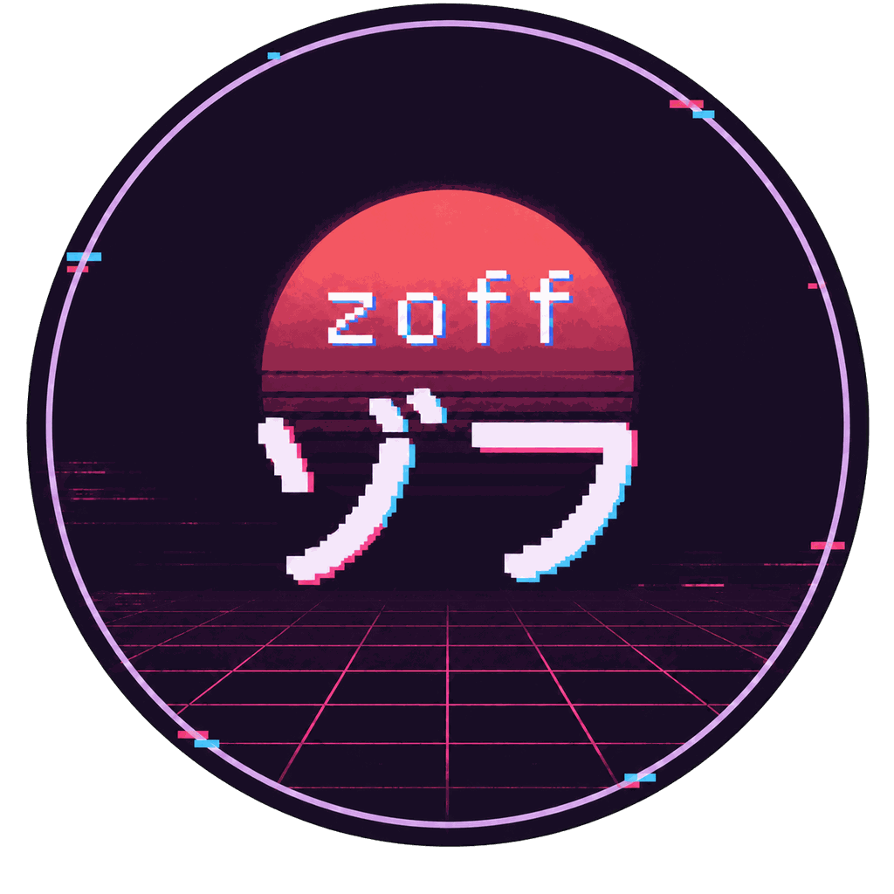
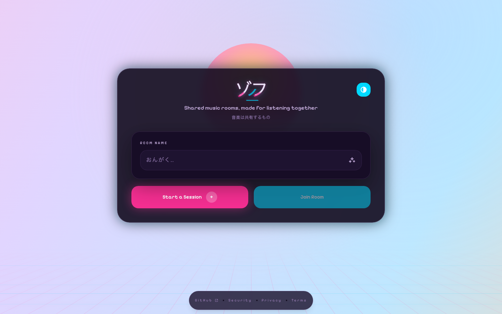
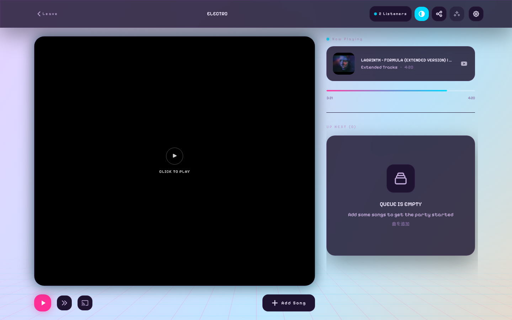

<p align="center">
  
</p>

# Vibes Frontend

A TypeScript monorepo for the Zoff web, native mobile, Cast, admin, and embed
clients, built with pnpm workspaces.

## Screenshots

### Front page



### Playlist room



## Applications

- **`apps/platform`**: The main web application for room management, queueing, and social interaction (SSR-enabled)
- **`apps/admin`**: Admin application served separately while preserving the admin route surface
- **`apps/cast`**: A standalone Chromecast Receiver application for synchronized playback on Google Cast devices (SSR-enabled)
- **`apps/embed`**: A standalone SSR embed player served at `/embed/:roomName` by default
- **`apps/mobile`**: The native iOS and Android app built with Expo Router and React Native

The ordered Android store-listing captures live under
`apps/mobile/docs/google-play/screenshots/phone`.

## Shared Packages

- **`packages/api`**: Type-safe API client
- **`packages/models`**: Shared domain types, interfaces, and validation schemas
- **`packages/shared`**: Shared React hooks, utilities, and Zustand stores (includes safeWrap error handling)
- **`packages/serve`**: Shared TypeScript server, metrics, and tracing utilities
- **`packages/ui`**: Shared DOM UI and player components for the web applications

## Development

```bash
# Install dependencies
pnpm install

# Run the main platform app (port 3001, SSR-enabled)
pnpm dev

# Run all apps
pnpm --recursive dev

# Run the embed app (port 3006)
pnpm --filter @vibes/embed dev

# Run the native mobile app
pnpm --filter mobile start

# Build and launch a native development client
pnpm --filter mobile android
pnpm --filter mobile ios
```

Set `EMBED_BASE_PATH` in both `apps/platform/.env` and `apps/embed/.env` to
change the local embed mount path. Embed URLs accept the optional boolean query
parameters `player`, `playlist`, `skip`, and `vote`. Embedded playback always
requires an explicit visitor interaction.

For sender and receiver testing with a local API, PostgreSQL database, and
Redis instance, see [Local Cast development](docs/local-cast-development.md).

## Server-Side Rendering (SSR)

The web applications support SSR for improved performance and SEO. The mobile
app is a native Expo application and is not built for web:

- **Platform App**: SSR with room data prefetching
- **Admin App**: SSR for admin views
- **Cast App**: SSR for faster Chromecast loading
- **Development**: Hot module replacement with SSR
- **Production**: Optimized SSR builds
- **Mobile**: Native Android and iOS routes with Expo Router

## Tooling

- **Linting & Formatting**: [Biome](https://biomejs.dev/) (`pnpm lint`, `pnpm fix`)
- **Type Checking**: TypeScript (`pnpm typecheck`)
- **Testing**: Vitest
- **Error Handling**: `safeWrap`/`safeWrapAsync` utilities (no try/catch)
- **Styling**: Tailwind CSS v4 on web and NativeWind on mobile, both with dark mode support

## Key Features

- **Dark Mode**: System preference detection with manual toggle
- **Error Handling**: Safe error handling with `safeWrap` utilities
- **Type Safety**: Full TypeScript with `@vibes/api`
- **Real-time**: SSE integration for live updates
- **Responsive**: Responsive web layouts and dedicated native mobile screens

## Rules

Please read the [AGENTS.md](./AGENTS.md) for non-negotiable frontend coding conventions and file layout rules.
