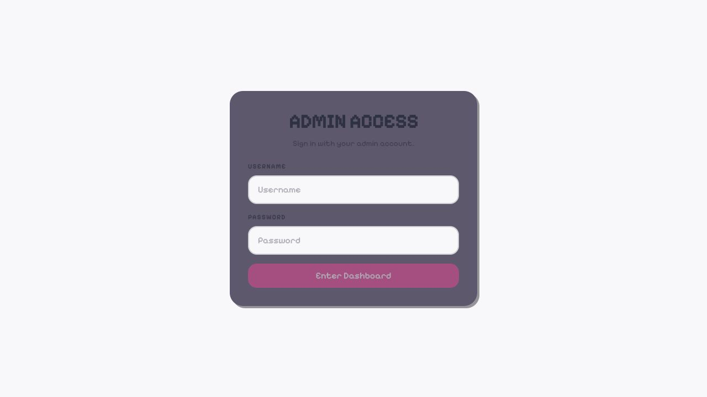

# Zoff Admin

The separately served administration application for managing Zoff rooms and
users through the protected admin route surface.

## Visual preview



## Development

From the repository root:

```sh
pnpm --filter @vibes/admin dev
```

The development server runs at `http://localhost:3005/admin`.

Validate the app with:

```sh
pnpm --filter @vibes/admin lint
pnpm --filter @vibes/admin typecheck
pnpm --filter @vibes/admin build
```
