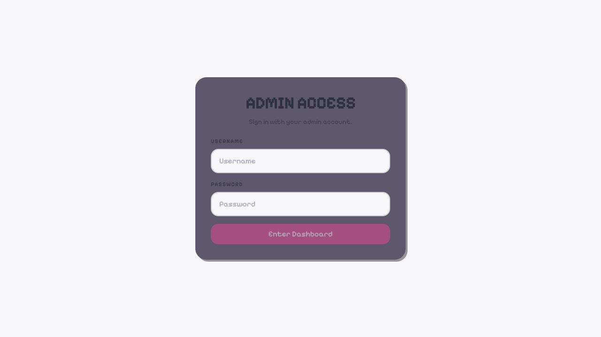

# Zoff Admin

The separately served administration application for managing Zoff rooms and
users through the protected admin route surface.

The shared `SiteBackground` from `@vibes/ui/web` matches the platform landing
page's themed gradient, glow, desktop scanlines and moving perspective grid.
It stays outside document flow, pauses in hidden tabs and respects reduced
motion. Login and error views use the same background without opaque page layers.

The overview separates Music and Watch totals. Room cards label the immutable
room type beside the room name. Search, chat and audience charts retain stacked
per-room series and show room types in legends, selectors and tooltips. Chart
type filters select Music or Watch without combining their room series; search
keeps separate cached and uncached lines. Audience breakdowns remain sampled at
the overall peak minute, rather than inventing independent per-type peaks.
Deleted rooms and older responses with no room type remain unknown in All rooms.

## Visual preview



## Development

From the repository root:

```sh
pnpm --filter @vibes/admin dev
```

The development server runs at `http://localhost:3005/admin`.

Validate the app with:

```sh
pnpm --filter @vibes/admin lint
pnpm --filter @vibes/admin typecheck
pnpm --filter @vibes/admin build
```
