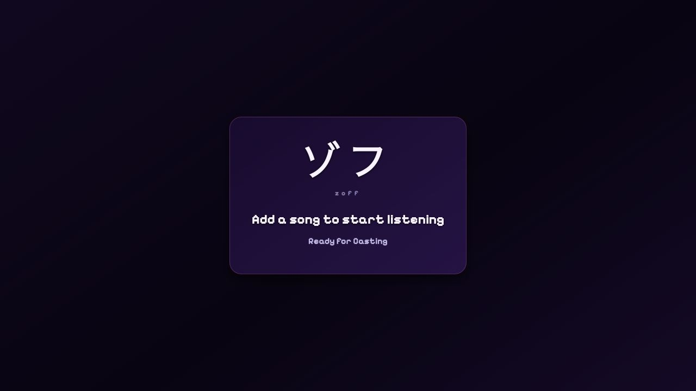

# Vibes Cast Receiver

The standalone Chromecast Receiver application for the Vibes ecosystem. It handles synchronized playback of multiple music providers on Google Cast devices.

## Visual preview



## 🚀 Getting Started

### Local Development
The receiver runs on port 3003.

```sh
pnpm install
pnpm --filter @vibes/cast dev
```

**Receiver URL**: `http://localhost:3003`

### Build System
The cast app uses Vite for local development and production builds.

- **Custom Build Script**: `scripts/build.ts` handles client-side bundling with environment variable injection
- **File Watching**: Automatic rebuilds on `.tsx`, `.ts`, `.css`, and `public/` file changes
- **Node.js Runtime**: Served through Vite preview in the production container
- **Environment Variables**: Automatic `VITE_*` prefix mapping and defaults for Cast configuration

### React Router data architecture

The receiver is a React Router SPA. Room bootstrap REST reads run in its route loader and mutations run in its route action. Receiver components consume loader data, submit mutations through fetchers, and subscribe to room SSE updates through `@vibes/api`.

### Development Scripts

```bash
# Development with watch mode and SSR
pnpm dev

# Production build (all assets)
pnpm build

# Individual build steps
pnpm build

# Production server
pnpm preview

# Type checking
pnpm typecheck

# Linting
pnpm lint
```

## 🛠 Features

- **Multi-Provider Playback**: Support for YouTube (IFrame) and SoundCloud (Widget)
- **Authentication Bridge**: Receives provider state from the sender app via `LOAD` interceptors
- **Global State**: Synchronizes with the backend via a shared Zustand store (`@vibes/shared`)
- **Premium UI**: Dark-mode primary interface with glassmorphism and smooth animations
- **Data Router**: Loader/action request orchestration with recoverable route errors
- **Hot Module Replacement**: Instant development feedback

## 📡 Communication Protocol

The receiver communicates with sender applications (web/mobile) using standard Google Cast Message Interceptors:

- **LOAD Interceptor**: Processes incoming media requests
  - Extracts `customData.tokens` to seed the authentication cache
  - Extracts `customData.song` to update the local playback state
- **Status Reporting**: Reports playback position and volume state back to the sender

## 🏗 Architecture

### Build Pipeline
1. **CSS Processing**: Tailwind CSS with cascade layers flattened by PostCSS and Vite's `chrome80` CSS target
2. **Legacy Transpilation**: Uses `@vitejs/plugin-legacy` with `chrome >= 80`, legacy chunks, and runtime polyfills
3. **Client Bundle**: React Compiler memoizes compatible app/shared DOM components before legacy transpilation. Safe multi-pass Terser minification runs without changing browser targets.
4. **Asset Copying**: Public files copied to distribution directory
5. **Compression**: Build-time Brotli quality 11 and gzip level 9 sidecars are served by `@vibes/serve`. Older clients can negotiate gzip or uncompressed assets.

The Latin font subset is preloaded; remaining supported glyphs load through
CSS unicode ranges. Native fonts are not changed. Keep `cssTarget: 'chrome80'`,
the cascade-layer transform, and the legacy plugin when updating build tooling.
Verify both legacy output and modern output, not only the modern browser preview.

### Environment Configuration
The build system automatically handles environment variables:

```bash
# Default Cast configuration
VITE_CAST_APP_ID=1FAF5D9F
VITE_CAST_RECEIVER_URL=/casting/receiver/

# Custom configuration (optional)
CAST_APP_ID=your-app-id
CAST_RECEIVER_URL=your-receiver-url
FRONTEND_URL=your-frontend-url
```

### File Watching (Development)
The build script includes intelligent file watching:
- **Vite**: Development server and static production build
- **File Types**: Watches `.tsx`, `.ts`, `.css`, and `public/` directory changes
- **Debouncing**: Prevents excessive rebuilds during rapid file changes

## 🧩 Integration

This app is built with:
- **React 19**: Modern component architecture with SSR streaming
- **pnpm**: Workspace package manager
- **Tailwind CSS**: Theme-driven styling with legacy browser support
- **Legacy Transpilers**: Retains the configured Chrome 80 compatibility target
- **@vibes/shared**: Shared hooks, stores, and utilities
- **@vibes/models**: Type-safe API schemas and validation

## 🔧 Troubleshooting

### Common Issues

**Preview errors**: Rebuild with `pnpm build`, then run `pnpm preview`.

**SSR errors**: Check the server logs for `[SSR Error]` messages. The app includes graceful error recovery.

**HMR not working**: Ensure WebSocket connection is established. Look for `[HMR] Cast Client connected` in server logs.

## 🐛 Debugging

### Browser console

Set `VITE_DEBUG=true` in the receiver server's runtime environment, restart it,
and reload the receiver to enable browser/player diagnostics and the Cast SDK's
debug level. The same image works with debugging on or off. Without that flag,
the SDK uses its warning level and app-owned debug messages stay silent;
warnings and errors remain visible.

The server injects the boolean into the HTML entry before client scripts run,
including direct `index.html` requests. Hashed assets remain cached, but the
HTML document is not cached so it cannot retain a stale debug setting.

With runtime debugging enabled, `?debug=true` or `customData.debug=true` also
opens the existing on-screen debug panel. Neither can override a disabled
runtime flag. The sender's browser debug setting independently gates received
debug messages; received warning/error messages remain visible.

### Common Issues & Fixes

**Playback Position Resetting**
If you notice the playback position resetting to `0:00` when play/pause is toggled rapidly or during sync updates:
- **Cause**: The receiver receives `updatePlayback` or `syncPlayback` messages where `positionMs` might be 0 (default fallback) or slightly out of sync.
- **Fix**: The `CastProvider` has logic to **preserve the local playback position** if:
  1. The Song ID has not changed (same track).
  2. The incoming message has `positionMs: 0` (or missing).
  3. The local player has already progressed past 1 second (`> 1000ms`).
- **Logic**: This prevents the "restart from beginning" glitch while still allowing legitimate track changes to start from 0.

**Startup Crashes**
The receiver reports startup failures through `console.error` and a visible
error screen. These errors are not hidden by the browser debug flag.
