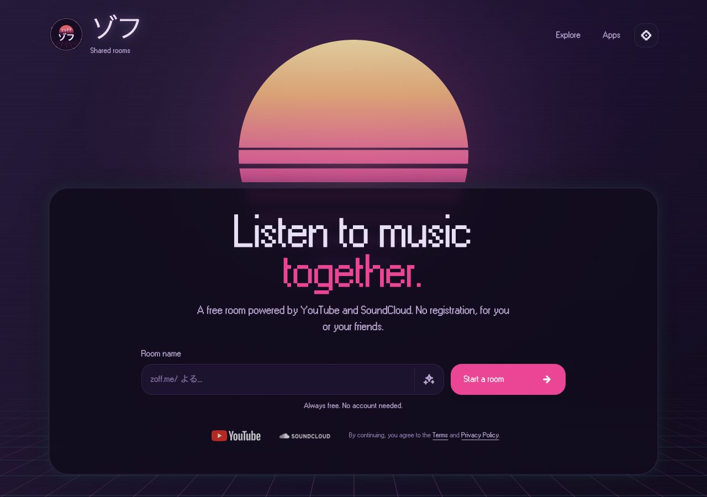
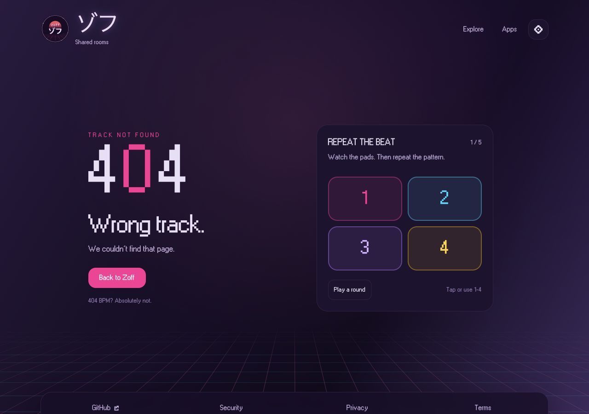

# Vibes Platform

The primary web application for the Vibes ecosystem. It serves as the main interface for users to create rooms, manage queues, and control synchronized playback across devices with full server-side rendering support.

## Embed sharing

The room's **Embed player** settings include an **Autoplay** toggle, off by
default. Enabling it adds `autoplay=true` to the embed URL, keeps the iframe's
`allow="autoplay; encrypted-media"` permission, and uses eager loading so the
player can start when the host page loads. Disabling the player also disables
autoplay in the generated code. Existing embeds remain click-to-play.

Autoplay requests sound, not muted playback. Browsers and host-page permissions
can still require a click; keep that limitation visible beside the toggle.

## Room playback

Joining a room automatically requests playback with sound through the existing
YouTube and SoundCloud players, following the room's current playback state.
Keep saved volume and mute preferences, local pauses, and paused host rooms
intact. Do not send room-wide play commands just because a listener joins.
Browser-blocked autoplay keeps the click-to-play fallback. Embed autoplay is
still a separate, default-off sharing option.

## Visual preview

### Landing page



### Active room


## 🚀 Getting Started

### Local Development
The platform app runs on port 3001 with SSR support.

```sh
pnpm install
pnpm --filter @vibes/platform dev
```

**App URL**: `http://localhost:3001`

### Development Scripts

```bash
# Development with SSR and HMR
pnpm dev

# Production build
pnpm build

# Type checking
pnpm typecheck

# Linting and formatting
pnpm lint

# Testing
pnpm test
```

## 🛠 Features

- **Collaborative Queue**: Real-time voting, reordering, and removal of tracks
- **Smart Search**: Unified search across YouTube and SoundCloud with debouncing and autocomplete
- **Synchronized Playback**: Leveraging Server-Sent Events (SSE) to keep all participants in perfect sync
- **Device Management**: Seamlessly switch playback between your browser and local Chromecast devices
- **Social Integration**: Shareable room links and generated QR codes for easy joining
- **Server-Side Rendering**: Fast initial page loads with intelligent data prefetching

## 🏗 Architecture

### Server-Side Rendering (SSR)
The platform app includes comprehensive SSR support via `server.tsx`:

- **React 19 SSR**: Uses `renderToReadableStream` for streaming HTML responses
- **Smart Data Prefetching**: Automatically fetches room data for `/room/{id}` routes
- **Intelligent Redirects**: Non-existent rooms redirect to create page with pre-filled name
- **Static File Serving**: Handles both development and production asset serving
- **Hot Module Replacement**: WebSocket-based HMR for instant development feedback

### Data Flow
1. **Initial Request**: Server pre-fetches room data if available
2. **SSR Rendering**: React renders with initial data, preventing loading states
3. **Client Hydration**: React takes over with pre-populated stores
4. **Real-time Updates**: SSE maintains synchronization after hydration

The v2 `song_updated` event inserts missing songs or repositions existing songs
at the backend-provided index. It also carries manually added songs, whose
automatic vote may place them ahead of the unvoted queue. Show the addition
notification only when the song is absent before applying that event, so votes
and replayed updates do not produce duplicate addition notifications.

### Route Handling
- **`/`**: Home page with room creation and joining
- **`/room/create`**: Room creation with optional `?name=` parameter
- **`/room/{id}`**: Room view with server-side room data fetching
- **Non-existent rooms**: Automatic redirect to create page with suggested name

## Missing pages



Unmatched paths and unknown discovery guides return a real HTTP 404 with
`noindex` metadata. The shared `NotFoundView` keeps the page on brand; the
platform adds a small, local-only memory game using shared buttons. It starts
on demand, supports touch and number keys 1–4, and pauses offscreen or in hidden
tabs. Reduced motion shows the pattern without flashing and lets the player
choose when to continue. Single-segment room names keep their existing room
creation flow. Other failures retain their retry screen.

## 🧩 Technical Stack

### Public product pages and search metadata

The homepage and `/rooms/create` have route-specific titles, descriptions,
canonical URLs and social previews. `/discovery/listening`,
`/discovery/queue`, `/discovery/rooms`,
`/discovery/apps` are server-rendered product pages. The apps guide includes
TV, casting and phone remotes; `/discovery/tvs` and `/discover/tv` permanently
redirect there. Explore uses four cards in a two-column grid. The
`/discovery/` prefix avoids claiming existing single-segment room names.

The previous `/discover/` URLs permanently redirect to the corresponding
`/discovery/` page, preserving query parameters. The party guide is folded into
the homepage voting demo: `/discover/party-music` and `/discovery/parties`
redirect directly to `/#voting`, preserving query parameters. Navigation,
canonical URLs,
structured data and the sitemap use only the new paths. Unknown guide names
return 404.

Product copy lives in `src/seo/productPages.ts`; adding a page there also adds
its sitemap entry. Keep the lightweight navigation list in
`src/seo/productNavigation.ts` in sync. Keep descriptions factual and public.
`/sitemap.xml` contains only stable product and policy URLs, never live rooms
or session data. `/robots.txt` points to this sitemap. The homepage identifies
the application and its store listings with SoftwareApplication JSON-LD.
All these public pages also use server-rendered WebSite and WebPage JSON-LD,
with stable canonical `@id` references to the same website and application.
Non-home pages have a two-step BreadcrumbList from the homepage to the current
page, matching the site's actual navigation without inventing an intermediate
`/discovery` landing page. Descriptions reuse the page's existing metadata.
Keep query parameters out of these identities, including room-name prefill.
Do not add this product markup to live rooms, embeds, operational routes, or
error pages. Do not invent ratings, reviews, or unsupported search actions.
The application identity is valid Schema.org markup; Google software-app rich
results additionally require genuine rating/review data, which Zoff does not
currently publish on these pages. Structured data does not guarantee a rich
result. Follow the [Google structured data guidelines](https://developers.google.com/search/docs/appearance/structured-data/sd-policies)
and [software-app requirements](https://developers.google.com/search/docs/appearance/structured-data/software-app).
Actual room pages use `noindex, follow`, including party/share variants and
the missing-loader-data fallback, while retaining their social-preview metadata.
Keep room URLs crawlable in `robots.txt` so crawlers can read the directive.
Room-creation URLs with `?name=` retain their form prefill and declare the clean
`https://zoff.me/rooms/create` URL as canonical. Do not remove useful query
parameters or apply `noindex` to these alternate product-page URLs.

Social metadata uses a content-hashed PNG from `src/assets/social-card.png`;
its editable vector source is alongside it. Regenerate the PNG at 1200×630
after changing the SVG. Verify page metadata in server-rendered HTML, including
canonical URLs without tracking parameters, rather than relying on hydration.

The homepage uses alternating product sections for voting, room controls,
AI playlist generation and remote control. App screenshots stay on the apps
guide, and the embed configurator stays on the rooms guide. The homepage's
server loader fetches community totals, public rooms and providers in parallel
and awaits the backend responses before rendering. Initial requests and client
navigation both use this server loader; there is no homepage `clientLoader`
or browser retry. The API client's normal timeout and request cancellation
still apply. Real totals are visible in the server-rendered HTML, including
without JavaScript. They sit above the queue section and count up when visible,
respecting reduced motion. Screen readers receive the full values without
announcing animation frames. Unavailable optional data are omitted; the
public-room browser link stays available even when no rooms are live. Keep copy
short and avoid repeating the same explanation in adjacent sections.

`/explore/rooms` lists twelve public rooms per page, with a live/all filter and
room-name search. The first request uses the server loader, defaulting to live
rooms. Hydration reuses that result without another request. Subsequent filter,
search and page navigation uses the route's `clientLoader` and `@vibes/api`
directly. Components only submit forms and navigate; they do not make REST
requests. Keep the previous results visible while loading and preserve filter
state in the URL. Search and filter changes reset pagination. The pager shows
an inline loading indicator and blocks duplicate pagination while a request is
pending. Existing room tiles are memoized so pending-state changes do not render
the list again. Page changes only reposition results when their heading is above
the viewport, using an immediate scroll rather than the site's smooth scrolling.

Both loaders use `/api/v2/rooms/public`, ordered by listeners, songs and ID,
all descending. The homepage requests only the first three live rooms through
its server loader. The homepage and browser share `PublicRoomTile` from
`@vibes/ui/web`. Keep the web homepage to Live rooms and a Browse all public
link to `/explore/rooms?live=false`; search, filters and pagination belong on
that dedicated route, not in the homepage. The Public setting lists a room in
Browse even without active listeners. The unfiltered browser has a stable sitemap and canonical URL;
search, pagination and filter variants use `noindex, follow`. Deploy the v2
backend endpoint before the frontend. Existing v1 clients remain supported.

The room-settings section uses a solid themed panel within the shared content
width and the same surfaces as the room cards. A brief accent sweep connects each
setting change to its result without adding a competing headline or logo. Its
three examples have distinct layouts: a listener's search result entering the
queue, the player's skip control obeying permissions, and a finished song either
returning to the queue or leaving it. Each example has one relevant room toggle
beside the action it changes. On phones, a compact selector and switch sit above
one scene. A search result becomes a queue row in the same space, rather than
leaving duplicate songs on screen. The room name and current rule sit above the
scene, with a full-width result caption below it. The rooms guide link
sits with the section introduction. Reserve matching space for the lazy-loading
placeholder, every toggle description, scene, and result caption so automatic
transitions never move adjacent content. Touch controls remain at least 44px tall.
Search results,
skip controls, song panels and queue rows reuse `@vibes/ui/web`; compact density
preserves the normal room presentation elsewhere.

Each automatic example shows both switch positions before moving to the next.
Crossfade between examples and restart the scene after a setting changes.
Selecting an example, changing a setting or trying an action restarts its time
in the tour without stopping autoplay. Keep focus within the scene when a
focused action disappears. Only run while the scene is in view, and pause in
hidden tabs. Reduced motion leaves the action manual. Automatic examples
do not announce themselves to screen readers. Keep the AI showcase unframed too,
rather than wrapping every demo in the same large card.

Discovery guides keep their first two explanations and practical notes visible
in the server-rendered page. Accordions cover follow-up questions about each
topic, including provider availability, room permissions and the difference
between joining a room and pairing a remote. Add useful instructions rather than
repeating homepage sales copy; keep detailed text out of animation captions.

The listening guide shows room chat using the same `ChatMessageLine` renderer
as real conversations. Its local sequence includes messages, adds, votes, skip
votes, skips, removals and name changes, then turns the shared Chat toggle off
to show the queue. The panel folds into the spinning Zoff logo before restarting.
The toggle is also usable manually, including with reduced motion. It changes
only the preview, never the visitor's saved preference. Keep messages bounded,
pause offscreen and in hidden tabs, and reserve the full preview height before
lazy loading. Device settings keep Chat as a compact toggle after the name
field, without explanatory paragraphs.

Request schemas and input controls share limits from `@vibes/models`: 500 for
chat messages, 30 for display names and 100 for room names. Room creation and
reservation, along with profile actions, validate before sending requests and
show the validation message. The backend independently enforces these limits.
Do not apply input limits to returned room/song metadata or existing room URLs.

Public pages provide a keyboard skip link before the header. Shared toggles
expose their label and description separately from the decorative OFF/ON
labels. Playback sliders announce elapsed time and duration. The queue demo
retains focus when its songs transition into the logo. Switching between room names
and AI prompts moves focus to the new input.

Product demos use placeholder songs and artwork in a room named `electro`.
Reuse `QueueItem`, `NowPlayingSong`, `PlaybackProgress`, `EmbedQueueSong` and
`SegmentedToggle` from `@vibes/ui/web`. Demo state stays in app-owned hooks;
it never sends provider requests or changes a real room. Do not introduce
alternate players, queue rows, equalizers or toggle implementations. Keep
provider links disabled for placeholder songs. The queue and playlist demos
use Framer Motion; playback follows local timers. Showcase animations loop while
in view, without pause or replay buttons. Interacting with a demo must not leave
its animation permanently paused. Keep the actual player controls that demonstrate
playback. Automatic motion pauses offscreen and in hidden tabs and respects
reduced motion. Lower-page demos
and app screenshots mount through `DeferredContent` near the viewport; keep
their headings, descriptions and navigation server-rendered. Reserve preview
space while loading so scrolling remains stable. The hero typing effect also
pauses when out of view. Keep the sun at its original position in the document,
so it scrolls away with the hero. Its upper half and gradient stay still while
the six lower bands gently narrow and settle in sequence. The shared Tailwind
animation runs on an eight-second loop with staggered phases; keep it still for
reduced motion and pause it when the sun or browser tab is hidden.

The generated playlist showcase types a prompt, shows the shared
`GenerationSparkles` from the real room-generation screen, then adds three
placeholder tracks to the queue. Completed playlists fade out before the next
prompt begins. Selecting an idea transitions to the new prompt; song changes
and playback-mode changes also use the shared `ContentTransition` component.
reduced motion shows the completed example without typing or transitions.
The homepage entry button opens and focuses the real generator without
submitting a request. Keep the feature copy and guide links server-rendered.

The homepage remote showcase puts the player's pairing details first, enters the
matching code on the phone and transitions into connected controls. On phones,
the compact player sits above the remote so both remain visible together. Use
labelled, thumb-sized playback buttons and a larger seek target. Pairing runs
automatically, holds the usable remote for twelve seconds, then crossfades back
to pairing. Using a remote control extends that time before the loop restarts.
Only announce pairing when the user requests it, rather than on every loop.
Reduced motion leaves pairing manual. All IDs, codes and playback in this demo
are local placeholders; never issue a real pairing request from the showcase.

The shared embed configurator exposes player, playlist, voting, skipping and
autoplay. Keep its small artwork and two queue rows visible without inner
scrolling. Its height matches the settings panel on desktop, and both panels
stack on mobile. The room guide contains setup steps; generated iframe code
belongs only in the real room's embed settings.

Keep all static presentation in Tailwind utilities and shared Tailwind
configuration. Discovery previews have no separate stylesheet. Accordion
content remains in server-rendered HTML, without height or text-opacity
animation. Background decorations must not widen the document or intercept
scrolling. The hero, guides and product sections use the common site layout;
room routes keep their player layout. The old `how-it-works` anchor remains
compatible without a separate jump link.

Optional session and remote reads do not retry during SSR. Homepage reads also
run on the server without retries.
Preserve request cancellation and timeouts. The local pixel font is preloaded, and the
shared server compresses production responses. Do not introduce external font
stylesheets or request backoff delays on public page loads.

The mobile search and remote pairing captures live in `src/assets/product/`.
Documentation screenshots live in `docs/screenshots/`; refresh them from the
actual browser UI and keep the organization profile in `zoff-music/.github`
in sync. Retain explicit image dimensions and lazy loading where appropriate.
The social-card SVG uses the circular logo and bundled MSW98UI font.

`SiteLayout` owns the shared header, navigation, personal settings and footer.
`SitePage` owns the content grid; `SiteHero` supplies the common heading scale,
spacing and framed surface. The homepage keeps a centered room-entry form;
guides split their content and preview when space allows. Terminal mode keeps
its own chrome and theme. Policy wording and revision dates must not change as
part of presentation work.

Desktop rooms use the available viewport space below the header, rather than
subtracting a cached header measurement. The player has a shrinkable media row
and a separate, content-sized control row in normal and party views. Keep the
provider mounted when changing views. Header measurement belongs to the header's
own lifecycle and is used only to position mobile share/settings panels; clear
it when the header unmounts and measure again when it returns.

- **Framework**: React 19 + TypeScript with SSR streaming
- **Runtime**: Node.js for production serving
- **State Management**: Zustand for high-performance, selective store subscriptions (playback, UI, auth)
- **Styling**: Tailwind CSS v4 with custom "retro-futuristic" design system and enhanced dark mode
- **API Engine**: `@vibes/api` for type-safe, validated request/response handling
- **Real-time**: Typed SSE subscriptions through `@vibes/api`
- **Build Tool**: Vite with React 19 optimizations and SSR support

## 📁 Source Structure

- `src/routes`: React Router route modules and colocated route workflows
- `src/components`: Platform-specific room, queue, casting, and layout components
- `src/hooks`: Platform workflows built on the shared typed API
- `server`: Production server entrypoint and SSR asset handling
- `@vibes/ui/web`: Shared DOM controls and provider players
- `@vibes/api`: Typed REST and SSE boundary

## 🔧 Environment Configuration

The platform app supports various environment variables:

```bash
# API Configuration
VITE_API_URL=http://localhost:8080

# Cast Configuration (inherited from root)
VITE_CAST_APP_ID=1FAF5D9F
VITE_CAST_RECEIVER_URL=/casting/receiver/

# Development
NODE_ENV=development|production
PORT=3000
```

## 🚀 Performance Features

- **SSR Streaming**: Immediate HTML delivery with progressive enhancement
- **Smart Prefetching**: Room data loaded server-side to eliminate loading states
- **Optimized Bundles**: Vite code splitting and tree shaking
- **Hot Module Replacement**: Sub-second development feedback
- **Zustand Optimization**: Selective subscriptions prevent unnecessary re-renders
