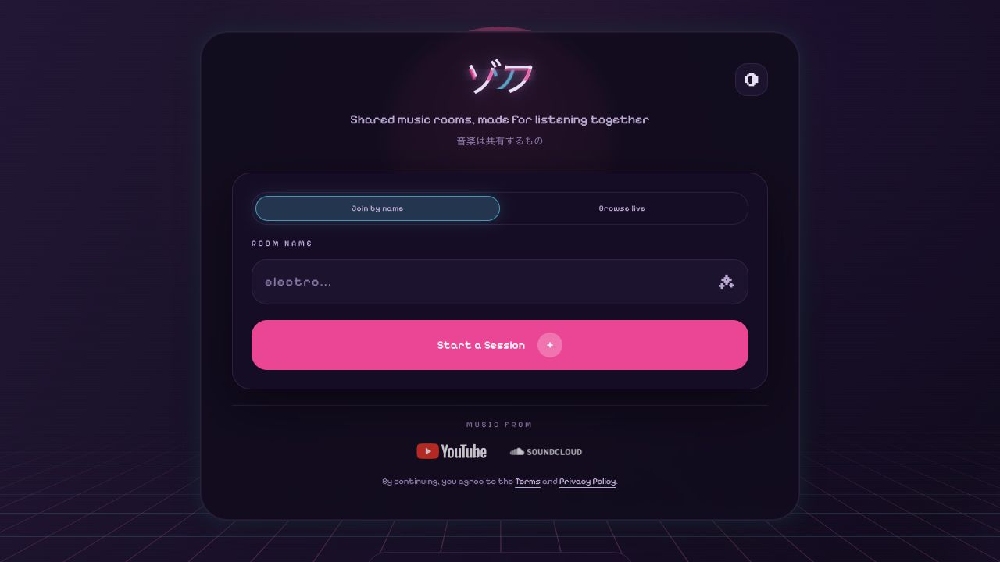
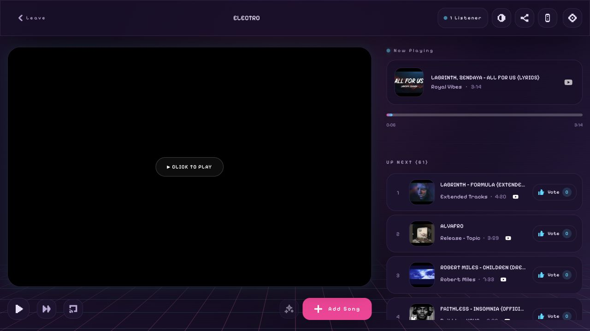

# Vibes Platform

The primary web application for the Vibes ecosystem. It serves as the main interface for users to create rooms, manage queues, and control synchronized playback across devices with full server-side rendering support.

## Visual preview

### Landing page



### Active room



## 🚀 Getting Started

### Local Development
The platform app runs on port 3001 with SSR support.

```sh
pnpm install
pnpm --filter @vibes/platform dev
```

**App URL**: `http://localhost:3001`

### Development Scripts

```bash
# Development with SSR and HMR
pnpm dev

# Production build
pnpm build

# Type checking
pnpm typecheck

# Linting and formatting
pnpm lint

# Testing
pnpm test
```

## 🛠 Features

- **Collaborative Queue**: Real-time voting, reordering, and removal of tracks
- **Smart Search**: Unified search across YouTube and SoundCloud with debouncing and autocomplete
- **Synchronized Playback**: Leveraging Server-Sent Events (SSE) to keep all participants in perfect sync
- **Device Management**: Seamlessly switch playback between your browser and local Chromecast devices
- **Social Integration**: Shareable room links and generated QR codes for easy joining
- **Server-Side Rendering**: Fast initial page loads with intelligent data prefetching

## 🏗 Architecture

### Server-Side Rendering (SSR)
The platform app includes comprehensive SSR support via `server.tsx`:

- **React 19 SSR**: Uses `renderToReadableStream` for streaming HTML responses
- **Smart Data Prefetching**: Automatically fetches room data for `/room/{id}` routes
- **Intelligent Redirects**: Non-existent rooms redirect to create page with pre-filled name
- **Static File Serving**: Handles both development and production asset serving
- **Hot Module Replacement**: WebSocket-based HMR for instant development feedback

### Data Flow
1. **Initial Request**: Server pre-fetches room data if available
2. **SSR Rendering**: React renders with initial data, preventing loading states
3. **Client Hydration**: React takes over with pre-populated stores
4. **Real-time Updates**: SSE maintains synchronization after hydration

### Route Handling
- **`/`**: Home page with room creation and joining
- **`/room/create`**: Room creation with optional `?name=` parameter
- **`/room/{id}`**: Room view with server-side room data fetching
- **Non-existent rooms**: Automatic redirect to create page with suggested name

## 🧩 Technical Stack

- **Framework**: React 19 + TypeScript with SSR streaming
- **Runtime**: Node.js for production serving
- **State Management**: Zustand for high-performance, selective store subscriptions (playback, UI, auth)
- **Styling**: Tailwind CSS v4 with custom "retro-futuristic" design system and enhanced dark mode
- **API Engine**: `@vibes/api` for type-safe, validated request/response handling
- **Real-time**: Typed SSE subscriptions through `@vibes/api`
- **Build Tool**: Vite with React 19 optimizations and SSR support

## 📁 Source Structure

- `src/routes`: React Router route modules and colocated route workflows
- `src/components`: Platform-specific room, queue, casting, and layout components
- `src/hooks`: Platform workflows built on the shared typed API
- `server`: Production server entrypoint and SSR asset handling
- `@vibes/ui/web`: Shared DOM controls and provider players
- `@vibes/api`: Typed REST and SSE boundary

## 🔧 Environment Configuration

The platform app supports various environment variables:

```bash
# API Configuration
VITE_API_URL=http://localhost:8080

# Cast Configuration (inherited from root)
VITE_CAST_APP_ID=1FAF5D9F
VITE_CAST_RECEIVER_URL=/casting/receiver/

# Development
NODE_ENV=development|production
PORT=3000
```

## 🚀 Performance Features

- **SSR Streaming**: Immediate HTML delivery with progressive enhancement
- **Smart Prefetching**: Room data loaded server-side to eliminate loading states
- **Optimized Bundles**: Vite code splitting and tree shaking
- **Hot Module Replacement**: Sub-second development feedback
- **Zustand Optimization**: Selective subscriptions prevent unnecessary re-renders
