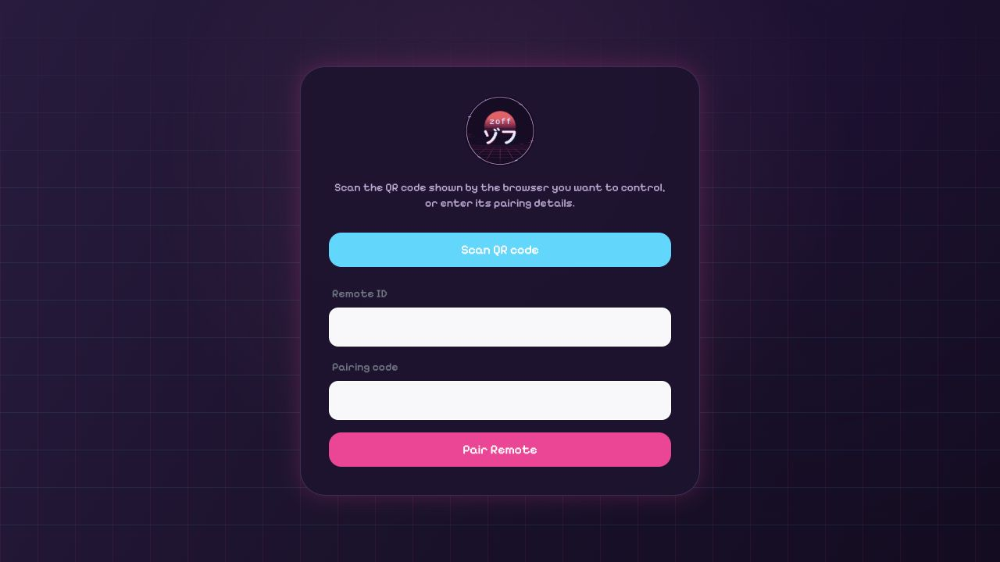

# Zoff Remote

The lightweight web controller for pairing with and operating another Zoff
screen. Visitors can scan the displayed QR code or enter a remote ID and
pairing code manually.

## Visual preview



## Development

From the repository root:

```sh
pnpm --filter @vibes/remote dev
```

The development server runs at `http://localhost:3007/remotes`.

Validate the app with:

```sh
pnpm --filter @vibes/remote lint
pnpm --filter @vibes/remote typecheck
pnpm --filter @vibes/remote build
```
