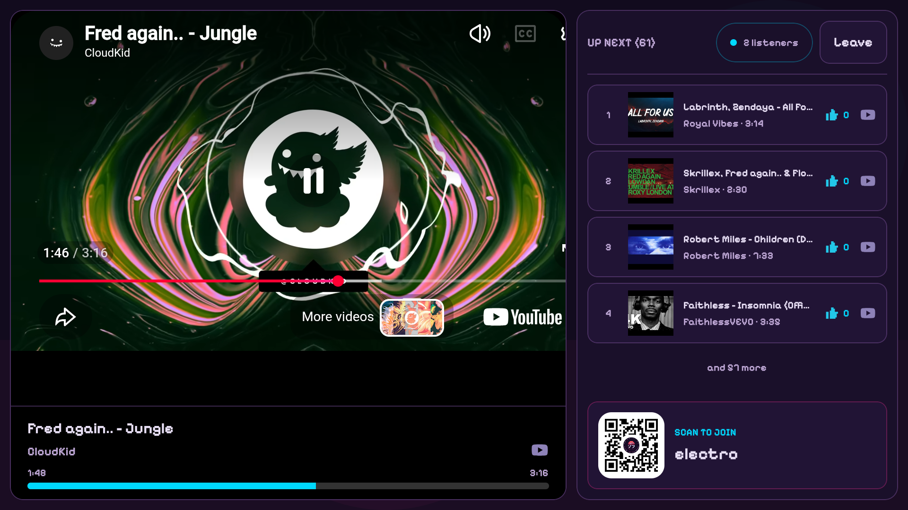

# Zoff TV

Zoff TV is one television application delivered to Android TV and Samsung TVs.
Both builds share the typed room/session hook, `@vibes/api`, `@vibes/models`,
and Zustand room stores. Only the renderer and packaging differ because the two
TV platforms run different application technologies:

- Android TV uses Expo, NativeWind, React Native TV focus handling, and official
  provider WebViews.
- Samsung TV requires a browser-based application package, so that target uses
  Tailwind, spatial remote navigation, and official provider iframes.

## Visual preview

### Android TV



The queue is intentionally bounded to five visible rows. Viewers scan the QR
code to add songs and vote from another device rather than manipulating a long
queue with the television remote.

tvOS is intentionally not targeted. Apple TV does not expose a WebView, so it
cannot run YouTube's required official IFrame Player. Extracting direct YouTube
media streams is not a supported or policy-compliant replacement.

## Features

- Join or create a room by name.
- Generate a new room and playlist from the AI prompt toggle.
- Browse up to six currently active public rooms.
- Live room, listener, playback, generation, and queue updates over SSE.
- Official YouTube and SoundCloud provider surfaces.
- Cast-style current track, five-song queue, listener count, votes, and a QR
  code linking directly to the room.
- Directional focus and visible focus feedback for television remotes.

## Install and validate

From the repository root:

```sh
pnpm install
pnpm --filter @vibes/tv lint
pnpm --filter @vibes/tv typecheck
pnpm --filter @vibes/tv validate
```

The production API defaults to `https://zoff.me`. Override it for a reachable
local backend:

```sh
EXPO_PUBLIC_API_URL=http://192.168.1.20:8080 pnpm --filter @vibes/tv start
VITE_API_URL=http://192.168.1.20:8080 pnpm --filter @vibes/tv tizen:dev
```

## Android TV

Expo Go does not support television projects. Generate and run a development
build instead:

```sh
pnpm --filter @vibes/tv android:prebuild
EXPO_TV=1 pnpm --filter @vibes/tv android
```

The config plugin marks Leanback as required, disables the touchscreen
requirement, installs the 320×180 TV banner, and registers the Leanback launcher
activity. Use an Android TV emulator or physical Android/Google TV device.

### Expo Application Services

The Expo project is
[`@zoff-music/vibes-tv`](https://expo.dev/accounts/zoff-music/projects/vibes-tv).
Its EAS project ID and Android TV build profiles are committed without any
credentials or account secrets.

Create an installable development build or internal preview APK:

```sh
pnpm --filter @vibes/tv android:build:development
pnpm --filter @vibes/tv android:build:preview
```

Create the Google Play App Bundle only when preparing a release:

```sh
pnpm --filter @vibes/tv android:build:production
```

After the first App Bundle has been uploaded manually and Google Play API
credentials have been configured privately in EAS, submit the latest production
build to the internal track with:

```sh
pnpm --filter @vibes/tv android:submit
```

Never commit a Google service-account key. Samsung Tizen certificates are also
managed outside the repository and are not handled by EAS.

## Samsung TV

Build the self-contained Samsung TV web package:

```sh
pnpm --filter @vibes/tv tizen:build
```

The output is written to `apps/tv/dist/tizen` and includes `config.xml`, the
application icon, bundled Jersey 15 font, JavaScript, and CSS. In Tizen
Studio:

1. Import `apps/tv/dist/tizen` as an existing Tizen web project.
2. Select the Samsung TV certificate profile for the target device.
3. Build the signed package and run it on a TV emulator or registered device.

The Tizen target uses `tizen.html` as its configured entry point and requires
the Internet privilege for the Zoff API and provider players.

## Visual review

Store submission and review screenshots belong in [`docs`](./docs/README.md).
Capture both landing and active-room states at 1920×1080 after verifying focus,
text truncation, QR readability, and official provider controls.
