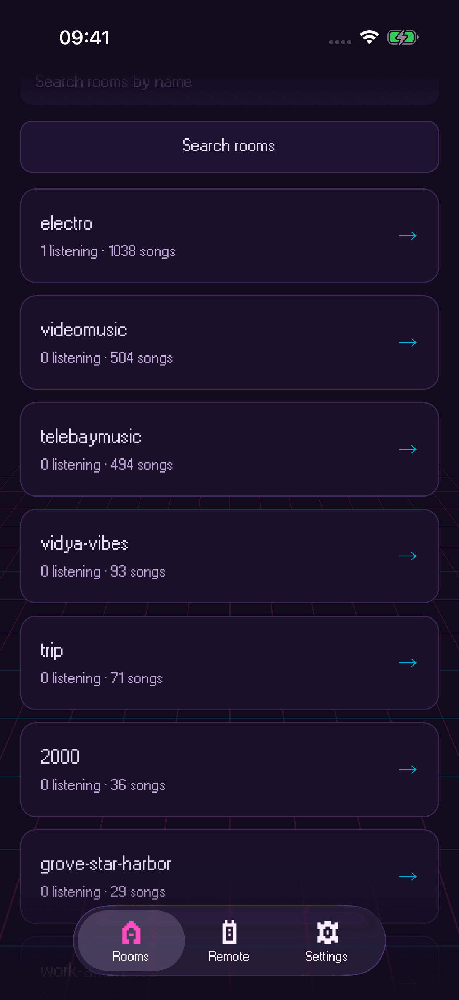
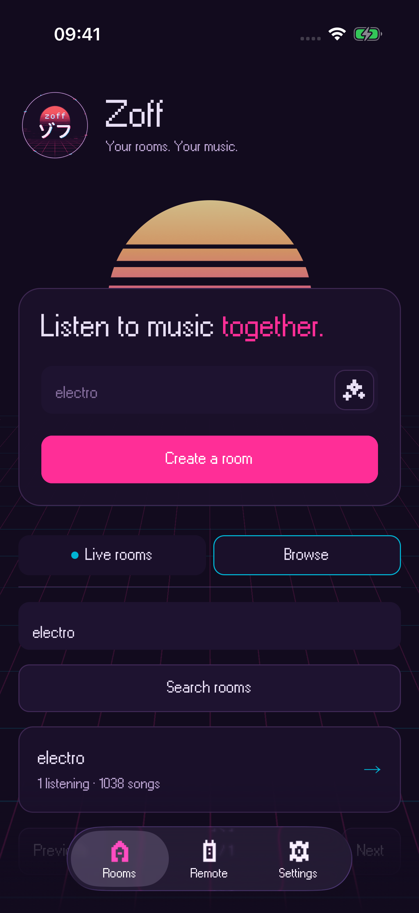
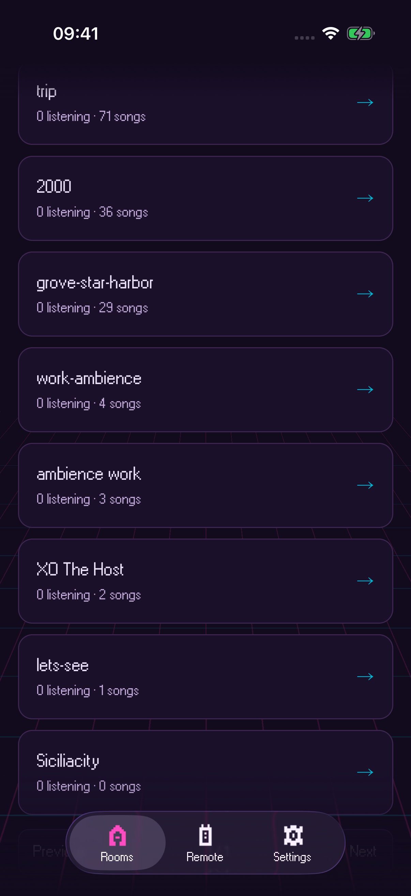
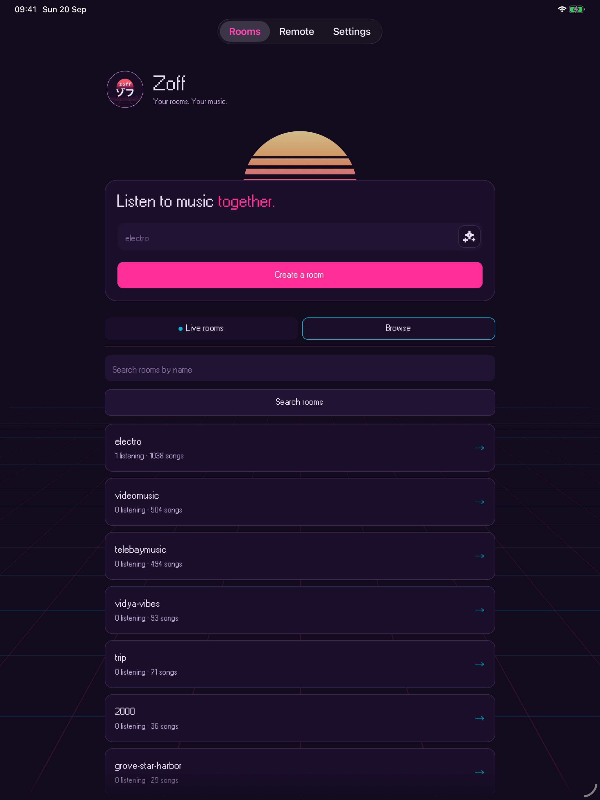
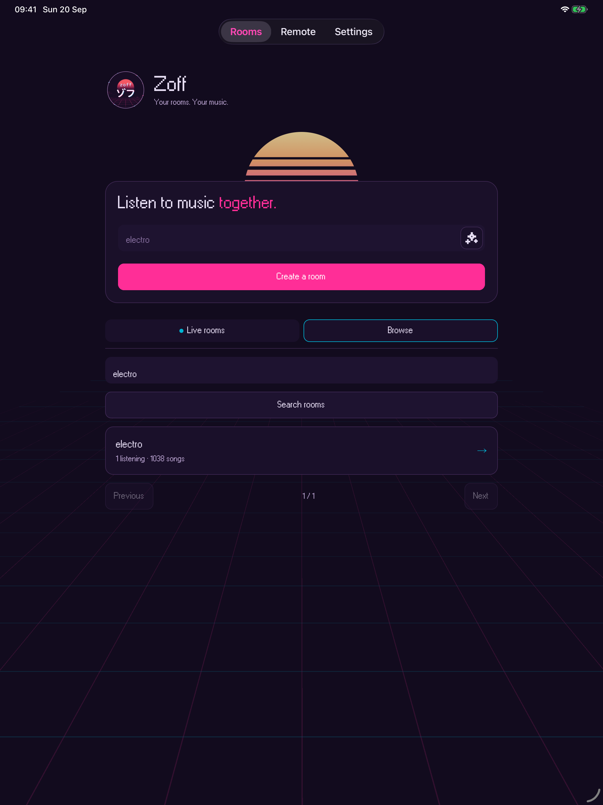
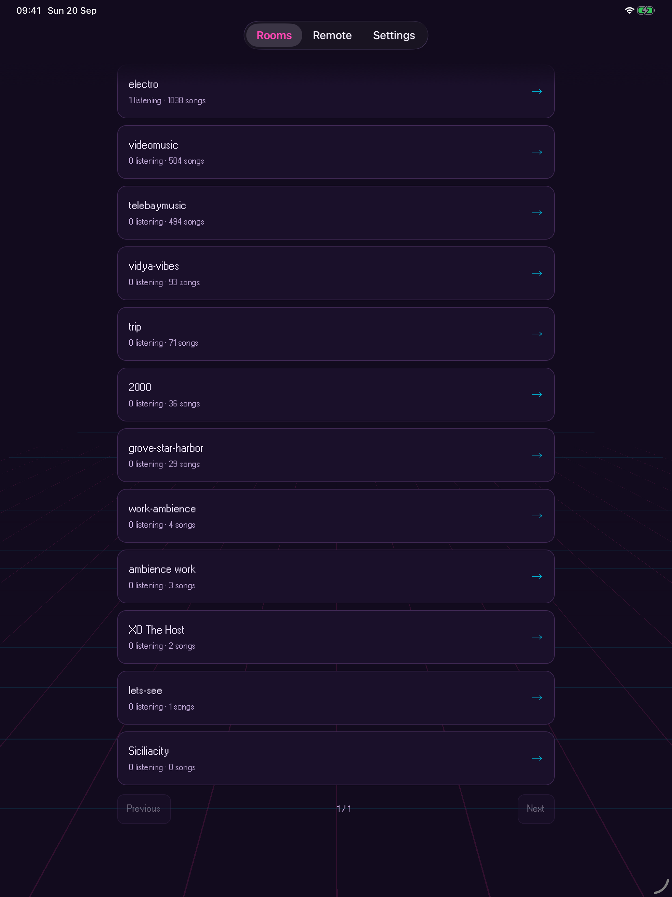
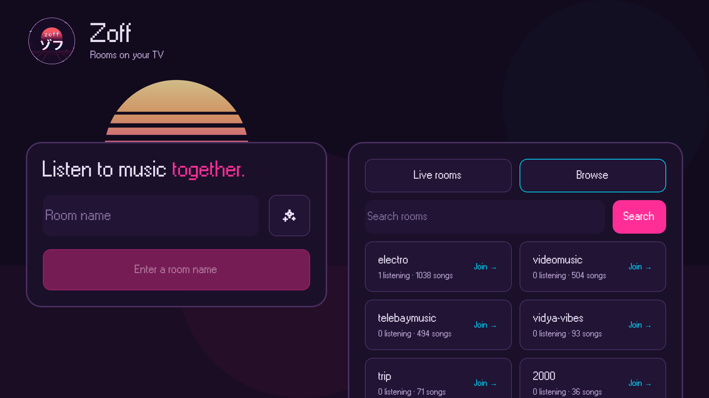
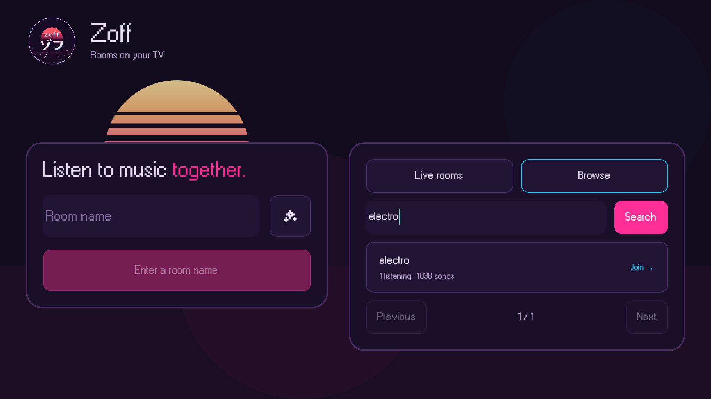
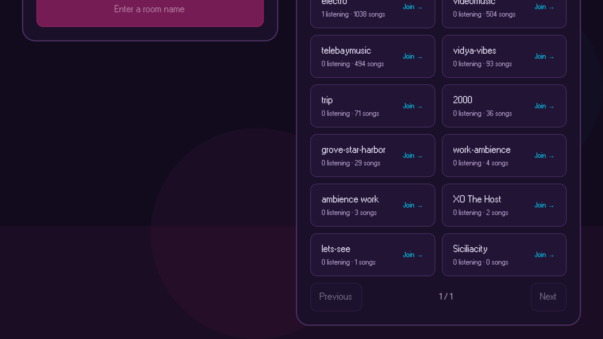

# Mobile 0.4.0 and TV 0.2.0

This release refreshes the native landing screens without changing room,
remote, or settings screens.

- Use the Zoff logo, shared listening slogan, and striped sunrise.
- Keep phone and tablet landing content in one stacked column.
- Animate room and playlist prompt suggestions on mobile, with selection
  haptics and reduced-motion, screen-reader, and app-lifecycle safeguards.
- Use solid room cards, calmer room typography, and outlined selected tabs.
- Browse public rooms in pages of twelve, with search and paging on TV too.
- Keep native and Samsung TV branding and room-browser layout aligned.

## Validation

Frozen-lockfile installation, workspace lint and typecheck, mobile validation,
and TV validation including the Samsung renderer production build passed.

The screenshots below show the release source running in native preview
clients. Store binaries are built separately with the production profiles.
Live public-room data currently fits on one page, so the pagination captures
show correctly disabled previous and next controls. Physical-device haptic
feel is not verified by simulator screenshots.

## iPhone

## iPad

## Android TV

